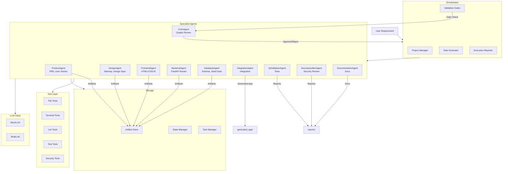

# AgentSite Implementation Plan

## 1. Concise Implementation Plan

### Phase 1: Core Infrastructure (Days 1-2)
- Set up project structure with proper Python packaging
- Implement state manager for pipeline tracking
- Build artifact store for structured outputs
- Create task manager with JSON-based tickets
- Develop unified LLM client (MockLLM + RealLLM)
- Implement tool layer abstractions

### Phase 2: Agent System (Days 3-4)
- Build agent registry with role-based capabilities
- Implement all 10 specialist agents with prompts
- Create orchestrator for workflow management
- Add validation gates between phases

### Phase 3: Demo Application Generation (Day 5)
- Run framework to generate Employee Benefits Portal
- Generate all required artifacts
- Build working FastAPI + Jinja2 application
- Create SQLite database with synthetic data

### Phase 4: Quality & Security (Day 6)
- Implement QAValidatorAgent tests
- Run SecurityAuditorAgent checks
- Generate documentation
- Create CLI interface

### Phase 5: Testing & Polish (Day 7)
- Write unit tests for core components
- Create integration tests
- Verify all validation gates work
- Prepare demo script

## 2. Key Assumptions

1. **LLM Availability**: Framework works in mock mode without API keys; real LLM mode requires OPENAI_API_KEY or QWEN_API_KEY environment variable
2. **Python Environment**: Python 3.11+ available with pip
3. **Browser Testing**: Basic HTTP testing via TestClient; Playwright optional for advanced UI tests
4. **Antigravity Integration**: If native Antigravity APIs exist, adapter can be added; default is local orchestration
5. **Demo Scope**: Employee Benefits Portal is a simple CRUD app with forms, not a production HR system
6. **Security Scanning**: Static analysis only; no dynamic vulnerability scanning in demo

## 3. Proposed File Structure

```
/workspace/
├── cli.py                      # Main CLI entry point
├── pyproject.toml              # Project dependencies
├── .env.example                # Environment template
├── README.md                   # Main documentation
├── ARCHITECTURE.md             # Architecture overview
├── SECURITY.md                 # Security documentation
├── DEMO_SCRIPT.md              # Interview demo script
├── agentsite/                  # Main package
│   ├── __init__.py
│   ├── config.py               # Configuration management
│   ├── llm_client.py           # Unified LLM client
│   ├── state_manager.py        # Pipeline state tracking
│   ├── artifact_store.py       # Artifact storage
│   ├── task_manager.py         # Task ticket management
│   ├── orchestrator.py         # Main orchestrator
│   ├── validation_gates.py     # Quality gates
│   │
│   ├── agents/                 # Specialist agents
│   │   ├── __init__.py
│   │   ├── base_agent.py       # Base agent class
│   │   ├── registry.py         # Agent registry
│   │   ├── product_agent.py
│   │   ├── design_agent.py
│   │   ├── frontend_agent.py
│   │   ├── backend_agent.py
│   │   ├── database_agent.py
│   │   ├── integration_agent.py
│   │   ├── qa_validator_agent.py
│   │   ├── security_auditor_agent.py
│   │   ├── documentation_agent.py
│   │   └── critic_agent.py
│   │
│   ├── tools/                  # Tool abstractions
│   │   ├── __init__.py
│   │   ├── file_tools.py
│   │   ├── terminal_tools.py
│   │   ├── lint_tools.py
│   │   ├── test_tools.py
│   │   └── security_tools.py
│   │
│   └── templates/              # Jinja2 templates for generated app
│       ├── base.html
│       ├── home.html
│       ├── benefits.html
│       ├── faq.html
│       ├── eligibility.html
│       ├── contact.html
│       └── admin.html
│
├── artifacts/                  # Generated artifacts
│   └── (created at runtime)
├── state/                      # Pipeline state
│   └── state.json
├── reports/                    # Execution reports
│   └── (created at runtime)
├── generated_app/              # Generated Employee Benefits Portal
│   ├── main.py                 # FastAPI app
│   ├── models.py               # SQLAlchemy models
│   ├── routes.py               # API routes
│   ├── templates/              # HTML templates
│   ├── static/                 # CSS/JS
│   └── database.db             # SQLite DB
└── tests/                      # Test suite
    ├── __init__.py
    ├── test_llm_client.py
    ├── test_state_manager.py
    ├── test_task_manager.py
    ├── test_orchestrator.py
    ├── test_agents.py
    └── test_generated_app.py
```

## 4. Agent Architecture Diagram



## 5. Definition of Done

The AgentSite framework is complete when:

### Core Functionality
- [x] All 10 specialist agents implemented with working prompts
- [x] Orchestrator executes full pipeline from requirement to deployment
- [x] MockLLM provides deterministic responses for testing
- [x] RealLLM connects to OpenAI-compatible API when key available
- [x] All validation gates enforce quality checks
- [x] State persistence survives process restarts

### Generated Application
- [x] Employee Benefits Portal runs without errors
- [x] All 6 pages render correctly (Home, Benefits, FAQ, Eligibility, Contact, Admin)
- [x] Forms submit and display success/error messages
- [x] SQLite database contains synthetic seed data
- [x] Responsive layout works on mobile/desktop
- [x] Basic accessibility (labels, alt text) present

### Quality Assurance
- [x] Unit tests pass for core components
- [x] API tests verify endpoint behavior
- [x] Security audit produces findings report
- [x] No hardcoded secrets in generated code
- [x] Input validation prevents basic injection attacks

### Documentation
- [x] README.md explains setup and usage
- [x] CLI commands documented
- [x] Demo script provided for interviews
- [x] Architecture diagram included
- [x] All 11 required artifacts generated

### Operational
- [x] `pip install -e .` works
- [x] `python cli.py run "..."` generates complete app
- [x] `python cli.py validate` runs test suite
- [x] `python cli.py security` runs security scan
- [x] Reports generated in /reports folder
- [x] No manual intervention needed for demo run
